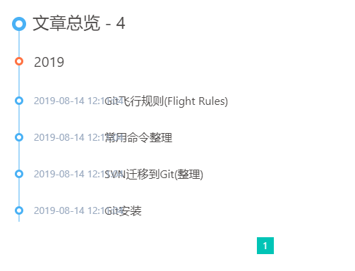
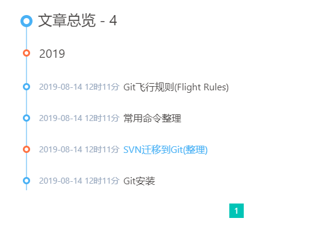
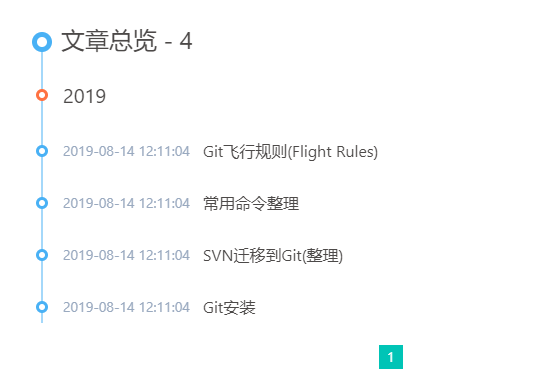

# sudot.net

使用[Hexo](https://hexo.io)将md文件生成静态页面

使用[Jerry Wong](https://github.com/jerryc127)修改的主题[Butterfly](https://github.com/jerryc127/hexo-theme-butterfly)，使用文档很完整很详细，点击[查看使用文档](https://jerryc.me/posts/21cfbf15/)

## 感想

本来是想自己做一个 go 语言基于解析 md 文件来生成静态文件的应用，也以此来学习和练习 go 语言，  
但是：
1. 审美能力太弱,无法做出好看的主题
2. 在使用 flutter 的过程中偶然看见一个博客使用 hexo 和一款主题搭配很好看，又让我有了使用 hexo 来部署的想法
3. 自己做一时半会儿也做不好，既然也是基于解析 md 文件生成静态文件，和不先实际的试试 hexo 呢，就是最后还是自己做，那也可以借鉴 hexo 优秀的地方

于是，此项目由最初的 java 更改为 go，现在又更改成 html 了。 哈哈哈😄

## 目录结构

```
sudot.github.io
├──.deploy_xxx       ── 使用 hexo deploy 时提交到各指定平台的临时目录
├──node_modules      ── npm管理的本项目插件或工具在本地存储的目录
├──public            ── 使用 hexo generate 编译 source 目录后生成的可部署静态文件
├──scaffolds         ── 新建文章时使用到的模板存放目录
├──source            ── 资源目录。除 _posts 目录，已下划线(_)开始的的文件或文件夹和隐藏的文件将会被忽略。Markdown 和 HTML 文件会被解析并放到 public 文件夹，而其他文件会被拷贝过去。
├   ├──_data         ── 在我这个站点中，使用的 Butterfly 主题的配置文件目录
├   └──_posts        ── 存放原始文章的目录(hexo官方叫写作目录)。即所有书写的文章都应放在此目录下。
├──themes            ── 存放渲染站点的主题文件
├──_config.yml       ── hexo 的配置文件
├──.gitignore        ── git对文件跟踪规则的配置文件
├──db.json           ── 使用 hexo generate 产生的缓存文件，官方建议此文件只存于本地，但如果内置参数 permalink 使用了 id 属性，最好是随配置文件一起备份或提交。
├──LICENSE           ── 使用 hexo init xxx 生成项目时默认出现的，表示hexo-starter ： https://github.com/hexojs/hexo-starter 项目的开源许可协议
├──package-lock.json ── 项目依赖实际使用的版本，npm官方建议随项目提交，但是Windows平台和mac平台此文件会有细微差别，所以建议不提交。
├──package.json      ── npm依赖管理文件
└──README.md         ── 本项目说明文件
```

## 操作步骤

1. 拉取此配置仓库
  ```
  git clone -b hexo git@github.com:sudot/sudot.net.git
  ```
2. 拉取笔记仓库
  ```
  git clone git@github.com:sudot/notes.git source/_posts
  ```


## 修改原主题部分

### 修改首页子标题`subtitle`

修改原因: 原子标题只支持两串字符，不能任意添加多串  
修改结果：支持任意多串字符显示
修改方式：
1. 删除原`subtitle`下`sub1`和`sub2`属性
2. 在`subtitle`下添加`contents`属性，此属性为数组，可添加任意多行内容
3. 但是内容不能包含英文标点下的逗号(`,`)

### 优化归档页面时间轴显示

修改原因: 当`_config.yml`中`date_format`属性配置成`YYYY-MM-DD HH:mm:ss`时，时间会遮挡部分标题。效果如下：  
  

修改结果：在小于等于两个汉字混入的情况下，支持`date_format`全格式不遮挡标题。优化后的效果如下：  
  
  
  
修改方式：
1. 增加样式。  
  在样式文件`themes\Butterfly\source\css\_layout\page.styl`中，`.article-sort &-item &__title`后增加如下样式，与`&__title`属同级
    ```
    &__title-6
      display: block
      margin-left: 6rem
      color: $font-black
      text-decoration: none
      font-size: 0.8rem
      cursor: pointer

    &__title-7
      display: block
      margin-left: 7rem
      color: $font-black
      text-decoration: none
      font-size: 0.8rem
      cursor: pointer
    ```
2. 增加时间格式长度判断。  
  在页面文件`themes\Butterfly\layout\includes\mixins\article-sort.pug`中，将原语句
    ```
    a.article-sort-item__title(href=url_for(article.path))= article.title || 'No Title'
    ```
    修改为如下语句
    ```
    - var length = date(article.date).length
    if length <= 13
      a.article-sort-item__title(href=url_for(article.path))= article.title || 'No Title'
    else if length <= 16
      a.article-sort-item__title-6(href=url_for(article.path))= article.title || 'No Title'
    else
      a.article-sort-item__title-7(href=url_for(article.path))= article.title || 'No Title'
    ```
